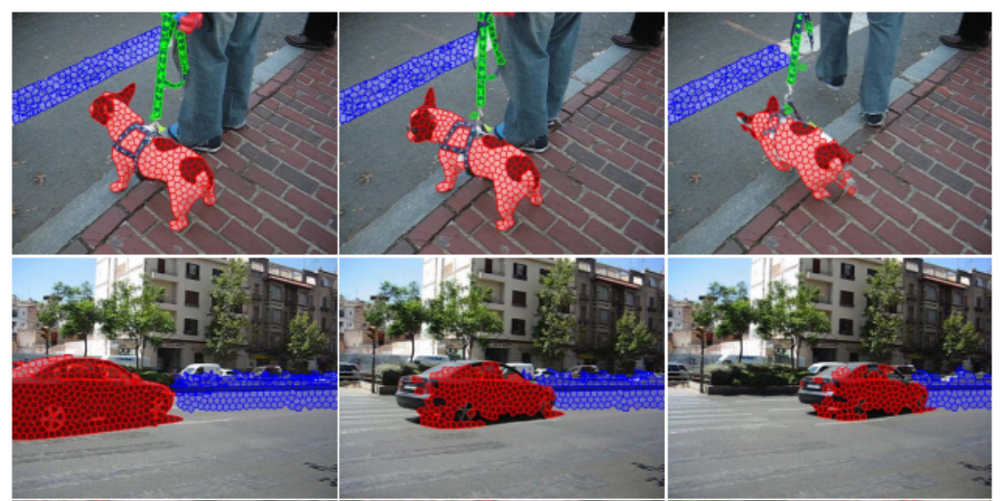

# [CVPR2013] Video Representation Using Temporal Superpixels

MATLAB (mex) implementation of CVPR 2013 paper [[link]](http://people.csail.mit.edu/jchang7/pubs/publications/chang13_CVPR.pdf)

*A Video Representation Using Temporal Superpixels*
[Jason Chang](people.csail.mit.edu/jchang7/), [Donglai Wei](http://people.csail.mit.edu/donglai/), and [John W. Fisher III](https://people.csail.mit.edu/fisher/)
In CVPR, 2013.
 

INSTALLATION
=================================
To get the Temporal Superpixel code working, please follow these steps:
1) Install the GNU Scientific Library - http://www.gnu.org/software/gsl/
2) Start MATLAB
3) In TSP directory, run "compile_MEX". Warnings for the compilation of the optical flow can be safely ignored. If GSL is installed in a directory that cannot be found by Matlab, you may need to edit compile_MEX.m to point to the right locations.

DEMONSTRATION
=================================
To run a demo of the TSP code, run "demo.m" from a Matlab prompt. This will first run optical flow for all the frames and then track superpixels. Following the completion of the inference, a GUI will be started to visualize the results.

To visualize a pre-computed result, you can run the following:
>> load('results/sp_labels_girl_demo.mat');
>> root = 'sequences/girl/';
>> view_sp_gui(sp_labels, root);
